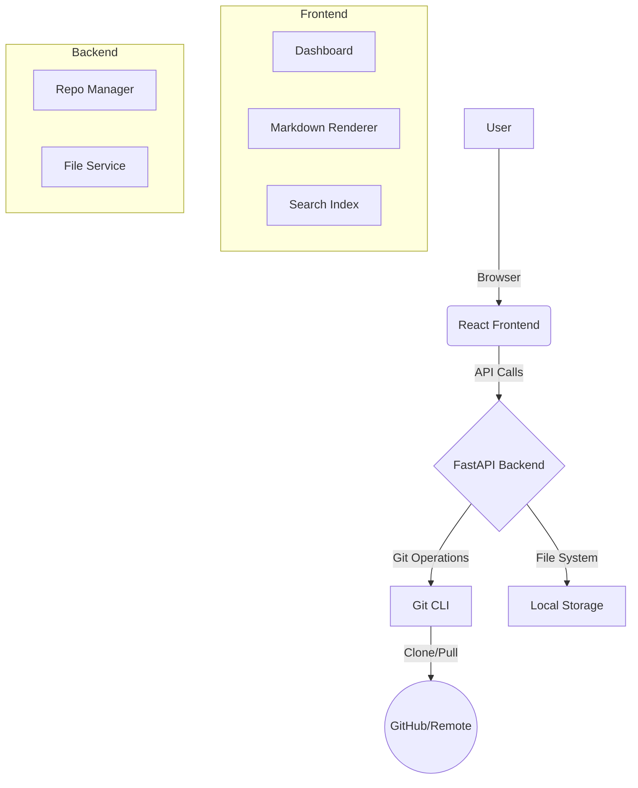

# RookDocs

RookDocs is a modern, developer-centric documentation viewer that treats your local Git repositories as the source of truth.

## Features

| Feature | Status | Description |
| :--- | :---: | :--- |
| **Local Repos** | ✅ | Connect any local folder or clone remote Git repos. |
| **Markdown** | ✅ | Full GFM support including tables and code highlighting. |
| **Search** | ✅ | Fast, client-side search across all connected docs. |
| **Private Repos**| ✅ | robust support for private repos with Fine-grained PATs. |
| **Mermaid** | 🚧 | Diagram support (testing below). |

## Architecture

## Getting Started

1.  Clone the repo.
2.  Run `make install`.
3.  Start with `make dev`.
