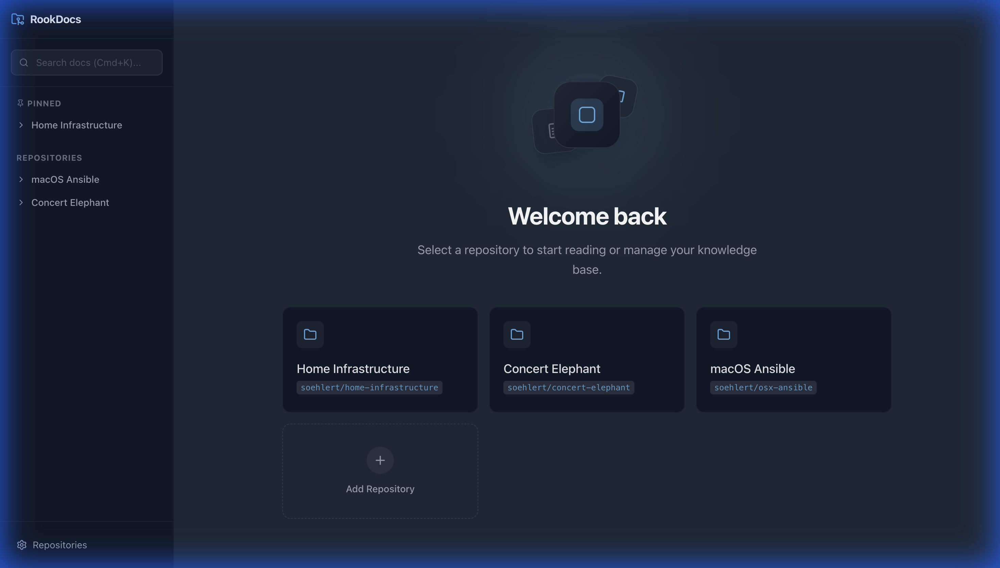
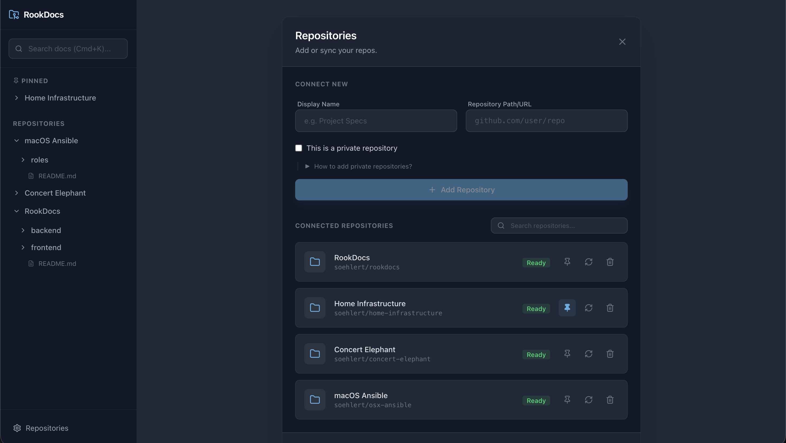
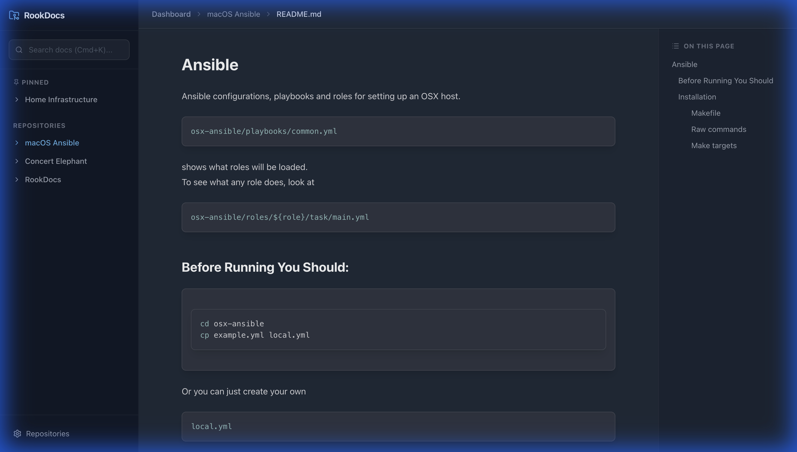

# RookDocs

RookDocs is a modern, developer-centric documentation viewer that treats your local Git repositories as the source of truth.

## Features

| Feature | Status | Description |
| :--- | :---: | :--- |
| **Repos** | ✅ | Connect any git repo |
| **Markdown** | ✅ | Full GFM support including tables and code highlighting |
| **Search** | ✅ | Fast, client-side search across all connected docs |
| **Private Repos**| ✅ | robust support for private repos with Fine-grained PATs |
| **Mermaid** | ✅ | Diagram support |

## Screenshots

### Dashboard


### Repository Management


### Documentation Viewer


## Synchronization & Automation

RookDocs supports multiple ways to keep your documentation in sync with your source repositories.

### 1. GitHub Webhooks (Owned Repositories)
The most efficient way to sync is using GitHub Webhooks. RookDocs provides a dedicated endpoint for push events.

1.  **Configure Secret**: Add `WEBHOOK_SECRET=your_secret` to your `backend/.env`.
2.  **Add Webhook**: In GitHub repository settings, add a webhook with:
    - **Payload URL**: `http://your-server-ip:8000/api/repos/webhooks/github`
    - **Content type**: `application/json`
    - **Secret**: (Must match your `WEBHOOK_SECRET`)
    - **Events**: Just the `push` event.

### 2. GitHub Actions (Owned Repositories)
Alternatively, you can trigger a sync via a GitHub Action. This is useful if you want to integrate syncing into a larger CI/CD pipeline.

```yaml
name: Sync Documentation
on: [push]
jobs:
  sync:
    runs-on: ubuntu-latest
    steps:
      - name: Trigger RookDocs Sync
        run: |
          curl -X POST http://your-server-ip:8000/api/repos/webhooks/github \
            -H "Content-Type: application/json" \
            -H "X-GitHub-Event: push" \
            -d '{"repository": {"clone_url": "${{ github.event.repository.clone_url }}"}}'
```

### 3. Periodic Sync (External Repositories)
For repositories you don't own (and thus can't add webhooks to), the simplest way to keep them updated is a local `cron` job on your server that pings the sync endpoint once a day/hour.

```bash
# Example crontab entry to sync an external repo every 6 hours
0 */6 * * * curl -X POST http://localhost:8000/api/repos/webhooks/github -H "Content-Type: application/json" -H "X-GitHub-Event: push" -d '{"repository": {"clone_url": "https://github.com/external/repo.git"}}'
```

## License

This project is licensed under the MIT License - see the [LICENSE](LICENSE) file for details.
